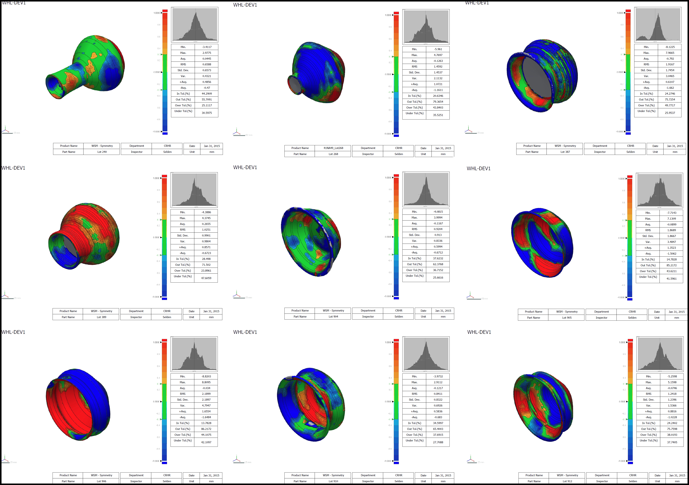

# asymmetry

This article, entitled "Asymmetry of Caddo Ceramics from the Washington Square Mound Site: An Exploratory Analysis," was published in [Digital Applications in Archaeology and Cultural Heritage](https://doi.org/10.1016/j.daach.2017.04.003) in 2017, and the preprint is available for download on [SocArXiv](https://osf.io/preprints/socarxiv/6atz3/). The LaTeX scripts are included in this repository, and can be viewed on [Overleaf](https://www.overleaf.com/read/rxqcygdgcjbf). The gahagan-analysis file contains the dataset (landmarks and semilandmarks) and R scripts used for the analysis. Unprocessed data have been uploaded to the [Open Science Framework](https://osf.io/dzktb/), and the processed meshes to [Zenodo @ CERN](https://zenodo.org/communities/wsm-41na49/?page=1&size=20).

### Abstract

While pursuing a study of 3D geometric morphometrics for ceramic burial vessels that often articulate with the Native American Graves Protection and Repatriation Act (NAGPRA) from the ancestral Caddo region, there have been no shortage of potentially meaningful observations, one of which--rotational asymmetry in coil-built vessels--is discussed here. Using Geomagic Design X (reverse-engineering software) and Geomagic Control X (inspection software), metrics associated with rotational asymmetry were generated then analyzed. Results indicate variable asymmetry among the different vessel shapes (i.e., bottles, jars, etc.), which may augment and strengthen studies and discussion of vessel form. Future directions include the incorporation of directional and--possibly--fluctuating asymmetry measures for the widest vessel profiles. Preliminary results point toward substantive analytical gains that can be used to augment more traditional ceramic analyses as well as geometric morphometric studies of ceramic vessel shape.
